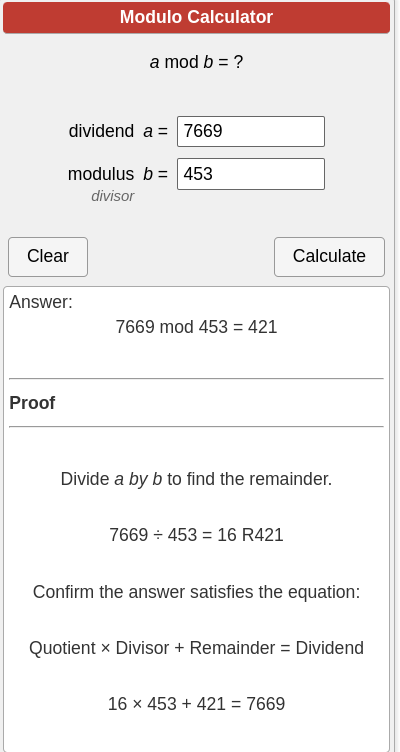

# Lab1 - Computer Security

This repository contains exercises and solutions for Lab1, which is part of a computer security course. The lab covers various cryptographic concepts and fundamental principles.

---
## How to Run

Each Python script can be run separately to see the solutions for each corresponding exercise. The web application inside `e1_number_properties` can be started with Flask by running `app.py`.

---

## Exercise 1 - Number Properties

### e1_number_properties
- A web application developed with Flask for checking prime numbers and calculating the Greatest Common Divisor (GCD).
- `e2_base64_hex_binary.py`: Python script to determine the Base 64, Hex and Binary values
- `e3_ASCII2str.py`: Python script to determine ASCII strings for encoded formats
- `e3.py`: Python script to determine the highest prime number within specified ranges.
- `e4_mod.py`: Python script to calculate the result of 7669 (mod 453), and his proof is:

## Exercise 2 - Greatest Common Divisor (GCD)

- `e1_gcd.py`: Python script to determine the GCD for pairs of numbers.
- `e2_co_prime.py`: Python script to check if pairs of numbers are co-prime.

## Exercise 3 - Modulus and Exponentiation

- `e1_mod.py`: Python script to calculate modulus operations.
- `e2_rsa.py`: Python script to perform modular exponentiation.
- `e3_highest_prime.py`: Python script to determine the highest prime number within specified ranges.
- `e4_prime_check.py`: Python script to check if a given number is prime.

## Exercise 4 - Random Numbers

- `e1_lcg.py`: Python script implementing a linear congruential generator (LCG) for pseudo-random number generation.
- `e2.py`: Python script implementing a linear congruential generator (LCG) for pseudo-random number generation.
- `e3.py`: Python script implementing a linear congruential generator (LCG) for pseudo-random number generation.
- `e4.py`: Python script implementing a linear congruential generator (LCG) for pseudo-random number generation.

## Directory Structure

* Lab1/
    * exercise1/
        * e1_number_properties/
            * static/
            * templates/
                * app.py
        * e2_base64_hex_binary.py
        * e3_ASCII2str.py
        * e4_mod.py
    * exercise2/
        * e1_gcd.py
        * e2_co_prime.py
    * exercise3/
        * e1_mod.py
        * e2_rsa.py
        * e3_highest_prime.py
        * e4_prime_check.py
    * exercise4/
        * e1_lcg.py
        * e2.py
        * e3.py
        * e4.py

The directory structure above represents the organization of the solutions for each exercise in the Lab1.
